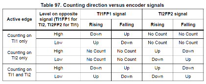

# Hardware changes for rev2

This file is to brainstorm possible changes to make to the rev1 hardware to create rev2.

## Ground pins

I need to add ground pins to the PCB so I can hook up grounds between this board and the printer board.  A few male header pins to the GND signal should be enough.  Possibly have these far enough away from other pins to be able to alligator clip onto them.

## Encoder channels (invalid option, see later)

The firmware is too slow to postprocess motor position from STEP/DIR edges when they're going quickly.  One possible solution would be to use the encoder function within the timer to process this via hardware.  This would require one channel per encoder.

There are a total of 6 timers that have encoder functionality.  We currently use 3 of these to process edges.  It is probably possible for us to use the other 3 as encoders.  This would look like the following:

* TIM1: 4 channels used to monitor STEP/DIR edges
* TIM8: 2 channels used to mointor STEP/DIR edges
  * Other 2 channels have a DMA conflict with TIM1 channels
  * Possible I could 
* TIM3: 2 channels used to monitor STEP/DIR edges
  * Other 2 channels can possibly be used as well.

* TIM2: encoder for X motor
  * Currently used to trigger ADC conversions.
  * Not sure how to free this up.
* TIM4: encoder for Y motor
  * Currently used as master timer.  I could quickly switch this from master timer to encoder mode after triggering other timers.  It may miss a few steps but this likely wouldn't even matter.  It is also possible the encoder mode will also trigger other channels, in which case switching wouldn't be necessary.
* TIM5: encoder for Z motor
  * Currently used for SECNT timer, which is easily moved to another timer.

### Encoder waveforms.

The following wavedrom script explains how we want the timer encoder to work.  Note how `CNT` should update right after a rising edge on `STEP` depending on the polarity of `DIR` at the time of the rising edge.

```
{signal: [
  {name: 'STEP', wave: 'lpppplppplpp'},
  {name: 'DIR', wave: 'h....l...h..'},
  {},
  {name: 'CNT', wave: '222222222222', data: ['0', '1', '2', '3', '4', '4', '3', '2', '1', '1', '2', '3']}
]}
```


I think this can work using encoder mode 1:
```
001: Encoder mode 1 - Counter counts up/down on TI1FP1 edge depending on TI2FP2 level.
```

I would hook up `STEP` to `TI2` and `DIR` to `TI1`.

Actually, this doesn't work.  It looks like the timer changes value on both rising and falling edges, like a traditional encoder.  Hmm...



## Encoder channels

What other way can we get motor position from processing STEP/DIR pins via hardware?  With unlimited timers, I can think of several ways, but we have limited timers.

I could add another chip to the board and dedicate that to handling this.  This complicates board layout, firmware, debugging, etc.  Not an attractive option.

This is only needed to simulate endstops.  I could simply only simulate endstops when necessary.  For example, when doing a homing operation.  Travel speeds during homing should be nowhere near the max speed.  I would expect speeds of under 20mm/s.  At 80 step/mm, this would be 1600 steps/s, which is very doable in software.
