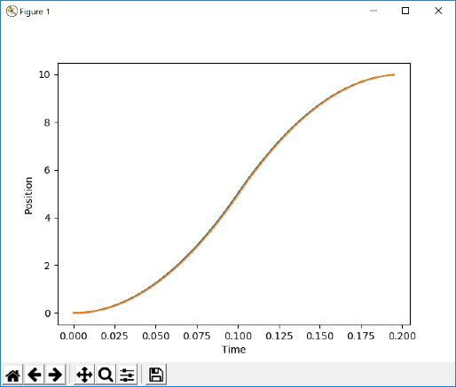
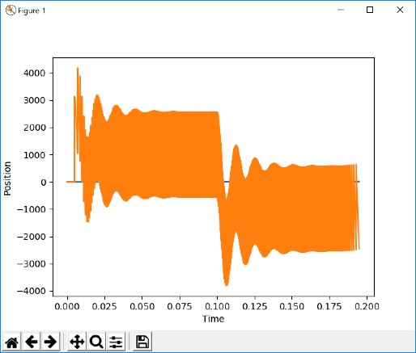
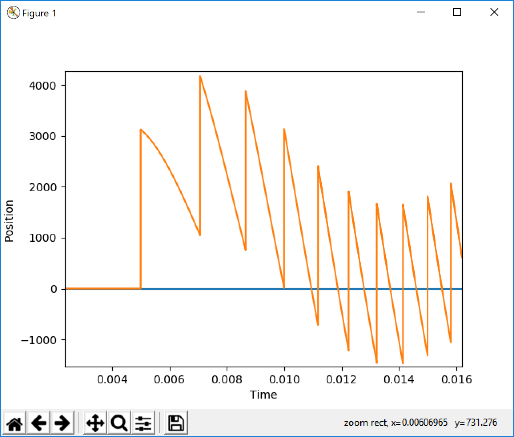
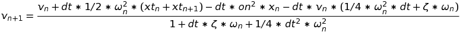
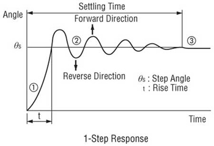
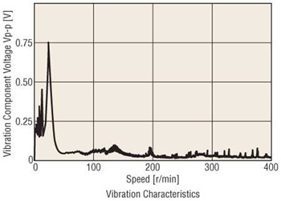
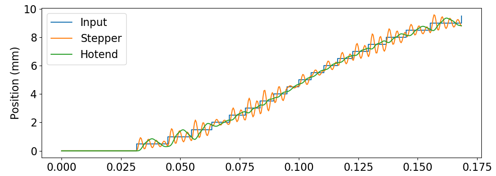
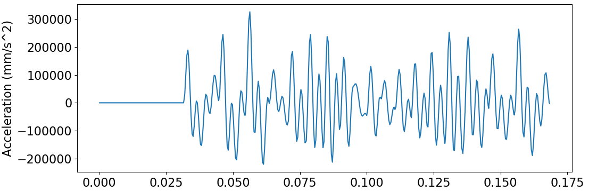

# Simulating the equations of motion

By monitoring the STEP and DIR signals, we know the target position of each motor.  This signal is discontinuous wich a jump occuring at every pulse of the STEP signal.  Since the derivative of this signal is infinite, we must use some other way to estimate the velocity of the motor.

This document looks at methods for deriving the position, velocity, and acceleration from the interpreted STEP/DIR signals.

## Equation of motion

We know the motor can't move instantly, so let's apply a force to the motor to make it move to its target position.

The force will be similar to the keeping force on a steppet motor.  It will be proportional to the difference between the target and actual position.  A damping force will also be present.

If the current position is x(t) and the target position is x_t(t), the equation of motion looks like the following:

* x"(t) = k * (x_t(t) - x(t)) - c * x'(t)
* v'(t) = k * (x_t(t) - x(t)) - c * v(t)

This equation can be solved even if x_t(t) is discontinuous.

We can solve this with the implicit midpoint method.

Let dt be the timestep.

* v_n+1 = v_n + dt * v'(t + dt / 2, (v_n + v_n+1) / 2)
* v_n+1 = v_n + dt * (k * (x_t(t + dt/2) - (x_n + v_n * dt / 2)) - c * ((v_n + v_n+1) / 2))

* v_n+1 = v_n + dt * k * x_t(t + dt/2) - dt * k * (x_n + v_n * dt / 2) - dt * c * v_n / 2 - dt * c * v_n+1 / 2
* v_n+1 * (1 + dt * c / 2) = v_n * (1 - dt * c / 2) + dt * k * x_t(t + dt/2) - dt * k * (x_n + v_n * dt / 2)

This works pretty well in Excel.

## Physical constants

We should ground our equation in reality.  We need to find values for m, k and c that make sense:

* m x" = k * x - c * x'

If we let x be the position of the nozzle, then m should be the weight of the hot end.  For direct drive printers, the hot end often has a NEMA 42-40 stepper motor on it.

Some NEMA 17 motors are listed here: https://reprap.org/wiki/NEMA_17_Stepper_motor

We will assume the following specs for the motor:
* 1.8 degree step angle
* 40 N*cm holding torque
* 370 grams (measured)

The stiffness translates to about 40 N*cm per 1.8 degrees.  This torque moves a belt over a pulley of diameter 0.7" (measured).  The pulley has 20 teeth and the belt has 1 tooth per 2mm, so the effective pulley diameter should be D = (40mm / pi). So this translates into a linear stiffness of 40 N*m / (40mm/2pi) / (1.8deg / 360deg * 40mm) = 180,000 lbf/in.  Seems a little high.

We will assume a mass of 150grams, which is probably about right for an Ender 3. 

This yields a natural frequency of sqrt(k/m) = 460 Hz.  This seems in the right ballpark.

We will calculate c based on the perceived damping ratio.  Based on ripples in the print after a 90 degree turn, the oscillations disappear after about 3-5 oscillations.  This gives us a damping ratio of around 0.2.

The unknowns k, c, m can be reduced to just the natural frequency (omega_n) and the damping ratio (zeta).  In these variables, the equation of motion above is equivalent to:
* x" = omega_n^2 * x - 2 * zeta * omega_n * x'

## In practice

I put together a script (equations_of_motion.py) which solves these equations of motion.  With omega_n = 500 Hz and zeta = 0.15, the position looked very reasonable.

However, the acceleration was still all over the place.

Zooming in, I can see the acceleration jumps whenever a STEP comes in

There's no way to avoid this with the parameters I have without significantly lowering the natural frequency of the system.  This may be similar to the actual behavior in real-life, as the printer emits a sound at the frequency of the STEP pulses.  However, it is undesirable for these high frequencies to show up in the simulated equations of motion.

To counteract this, I will first simulate the position of the stepper motor itself and then use this to simulate the position of the hot end.

## Equation derivations

To derive the equation of motion, we start with

* m * x"(t) = k * (x_t(t) - x(t)) - c * x'(t)
* m * v'(t) = k * (x_t(t) - x(t)) - c * v(t)

where v(t) is the velocity of the hot end, x(t) is the position of the hot end and x_t(t) is the position of the stepper motor (known).  We assume constant v' within a timestep.

* v'(t) = omega_n^2 * (xt(t) - x(t)) - 2 * zeta * omega_n * v(t)
* v'(t) = f(t, v(t), x(t))

Within a timestep, we know:

* x(t0 + dt) = x(t0) + dt * v(t0) + 1/2 * dt^2 * v'(t) 
* x_n+1 = x_n + dt * (v_n + v_n+1) / 2

Let v_n = v(t) and v_n+1 = v(t + dt).  Using the implicit midpoint method:

* v_n+1 = v_n + dt * f(t_n + dt / 2, 1/2 * (v_n + v_n+1), 1/2 * (x_n + x_n+1))

Substituting values gives us (Let on = omega_n, z = zeta):

* f(...) = omega_n^2 * (1/2 * (xt_n + xt_n+1) - 1/2 * (x_n + x_n+1)) - 2 * zeta * omega_n * 1/2 * (v_n + v_n+1)
* f(...) = omega_n^2 * (1/2 * (xt_n + xt_n+1) - 1/2 * (x_n + (x_n + dt * (v_n + v_n+1) / 2))) - 2 * zeta * omega_n * 1/2 * (v_n + v_n+1)
* f(...) = 1/2 * on^2 * (xt_n + xt_n+1) - 1/2 * on^2 * (2 * x_n + dt * (v_n + v_n+1) / 2) - z * on * v_n - z * on * v_n+1
* f(...) = 1/2 * on^2 * (xt_n + xt_n+1) + (-(on^2)) * x_n + (-1/4 * on^2 * dt) * v_n + (-1/4 * on^2 * dt) * v_n+1 - z * on * v_n - z * on * v_n+1
* f(...) = 1/2 * on^2 * (xt_n + xt_n+1) - on^2 * x_n - v_n * (1/4 * on^2 * dt + z * on) - v_n+1 * (z * on + 1/4 * on^2 * dt)

Our update then becomes:
* v_n+1 = v_n + dt * 1/2 * on^2 * (xt_n + xt_n+1) - dt * on^2 * x_n - dt * v_n * (1/4 * on^2 * dt + z * on) - dt * v_n+1 * (z * on + 1/4 * on^2 * dt)
* --> v_n+1 = (v_n + dt * 1/2 * on^2 * (xt_n + xt_n+1) - dt * on^2 * x_n - dt * v_n * (1/4 * on^2 * dt + z * on)) / (1 + dt * z * on + 1/4 * dt^2 * on^2)
* (and) --> x_n+1 = x_n + dt * (v_n + v_n+1) / 2

## Stepper motor behavior

Here is one page that discusses response to a single step input:
* https://www.orientalmotor.com/stepper-motors/technology/stepper-motor-overview.html

The vibration plot is interesting.  Here is a video on it:

* https://www.youtube.com/watch?v=Rv8NVF6ZLlQ

## Dual method results

After simulating both the stepper and the hot end, the results are okay

However, the forces involved are pretty intense.

A real stepper motor is going to have a top-end torque after which the force will roll off.  I should simulate the forces from the stepper motor better, and maybe simulate everything at once.  I will likely need to change the method away from the midpoint implicit method.

## Block method

The new method is to have simulate the hot end and the stepper motor position all at once.  To do so, we form a partial differendial equation (PDE) with the position and velocity of the stepper and hotend as variables.

### Stepper motor force

We will incorporate microstepping into the simulation.  The force from the stepper motor will be in the form of sine wave.  If x is the distance of the stepper away from its neutral position, x_s is the (full) step size of the motor, and F_max is the maximum force, the force from the stepper motor is

* F(x) = -F_max * sin(x / x_s * pi / 2)

Note that the motor achieves a maximum force a distance of x_s away from neutral.

Because of the inductance in the coils, the stepper cannot immediately switch phases.

This is still TBD.
