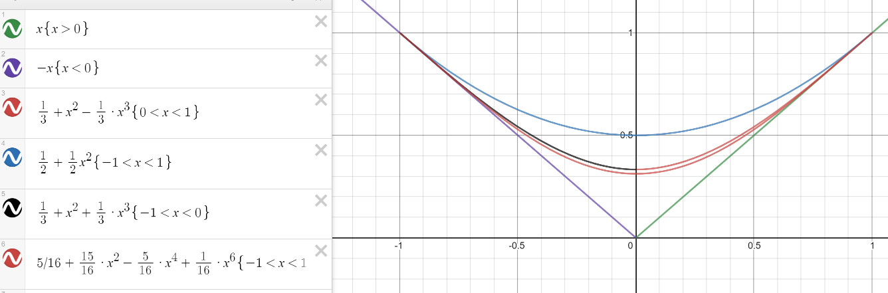

TinyG implementes a third-order jerk equation within a velocity change.

Around a junction, we want to solve:
* x'(t) = 1 
* y(-1) = 1
* y(1) = 1
* y'(-1) = -1
* y'(1) = 1
* y''(-1) = 0
* y''(1) = 0
* y'''(t) = a*t^3 + b*t^2 + c*t + d

We can integrate to find:
* y''(t) = 1/4*a*t^4 + 1/3*b*t^3 + 1/2*c*t^2 + d*t + e
* y'(t) = 1/20*a*t^5 + 1/12*b*t^4 + 1/6*c*t^3 + 1/2*d*t^2 + e*t + f
* y(t) = 1/120*a*t^6 + 1/60*b*t^5 + 1/24*c*t^4 + 1/6*d*t^3 + 1/2*e*t^2 + f*t + g

And solve using Mathematica.

Here is a comparision between paths using constant accel (blue), constant jerk (black/orange), and sixth order (red):

There is very little difference between the constant jerk path and the sixth order path.  The constant jerk also has the ability to limit max acceleration, which the sixth order doesn't have.  Maybe this is a plus, maybe not.
