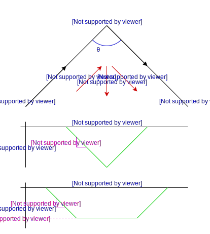

# Transition calculation

Within our path planner, we wish to move from one line segment to another line segment in such a way that we do not actually touch the corner, but rather smoothly transition from one segment to the next.  This has the advantage of having less of a jarring impact on the printer which results in better print quality.

## Problem statement

The problem we are trying to solve can be simplified as this:

* Assume we are moving on the line from point `p0` to point `p1` with velocity `vs`.
* We want to end up moving on the line from point `p1` to point `p2` with velocity `vf` such that `||vf|| == ||vs||`.
* We begin and end the transition a distance `d` away from point `p1`.
* The net velocity change `dv` is in the direction away from the corner at an angle that bisects the two paths.

The transition distance `d` must be minimized subject to the following constraints:
* The maximum acceleration `amax` cannot exceed `alimit`.
* The maximum jerk `j` cannot exceed `jlimit`.

Note that the velocity during the transition is slower than at the entry/exit points, so no additional limit on the velocity is necessary.

## Types of paths

There are two nontrivial types of paths in this scenario.  In one, the acceleration curve is a triangle and the maximum acceleration does not exceed `alimit`.  In the second type, the acceleration is a trapezoid profile.  In both, the slope on the diagonal lines in the profile is equal to `jlimit`.

## Calculations

Consider the above figure.  We can easily rearrange whatever coordinate system we're working with such that it lines up with this figure.  The change in velocity is then only in the negative y direction, and the velocity in the x direction does not change.

Let the initial speed be `s = ||vs||`.

We can decompose the initial velocity into its x and y components: `vs = vx*ex + vy*ey`.  Note that `vy = s * cos(theta / 2)` and `vx = s * sin(theta / 2)`.  The total distance we're traveling in the x direction is equal to `dx = 2 * d * sin(theta / 2)`.  Since `vx` doesn't change during the transition, the total time it takes to traverse this distance is `dt = dx / vx`.

Note that `dv = -2 * vy * ey`.

If our path is the first type, the maximum acceleration we hit is `amax = dt / 2 * jlimit`.  If this is greater than `alimit`, then our path must be the second type.  Otherwise, we must have `vy = dt / 2 * dt / 2 * jlimit`.  This gives us the final equation to solve.

If our path is the second type, the duration spent ramping to max on each side is `tramp = alimit / jlimit`.  The time spent at max accel must then be equal to `tflat = dt - 2 * tramp`.  The total velocity change must be `2 * vy = tramp * tramp * jlimit + alimit * tflat`.  This gives us the final equation to solve.

## Path type one

The knowns are angle `theta` and initial speed `s`.

Our equations to solve are:
* `vy = s * cos(theta / 2)`
* `vx = s * sin(theta / 2)`
* `dx = 2 * d * sin(theta / 2)`
* `dt = dx / vx`
* `vy = 0.125 * jlimit * dt^2`

We can solve these to find:
* `--> d = s * sqrt(2 * s * cos(theta / 2) / jlimit)`

## Path type two

The knowns are angle `theta` and initial speed `s`.

Our equations to solve are:
* `vy = s * cos(theta / 2)` --> vy is known
* `vx = s * sin(theta / 2)` --> vx is known
* `dx = 2 * d * sin(theta / 2)` --> d(dx) or dx(d)
* `dt = dx / vx`
* `tramp = alimit / jlimit` --> tramp is known
* `dt = 2 * tramp + tflat`
* `2 * vy = tramp * tramp * jlimit + alimit * tflat`
* `2 * vy = alimit * (tramp + tflat)`

Solve to find:
* `2 * s * cos(theta / 2) / alimit = tramp + tflat`
* `2 * s * cos(theta / 2) / alimit + alimit / jlimit = 2 * d * sin(theta / 2) / (s * sin(theta / 2))`
* `--> d = s^2 * cos(theta / 2) / alimit + 0.5 * s * alimit / jlimit`
